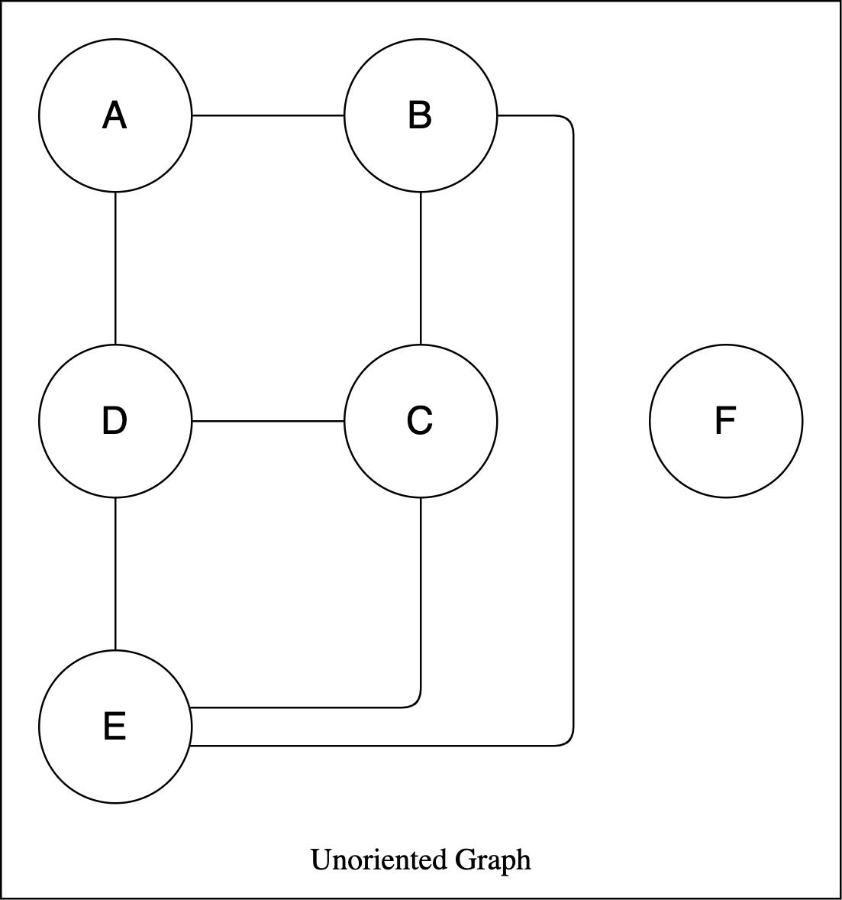
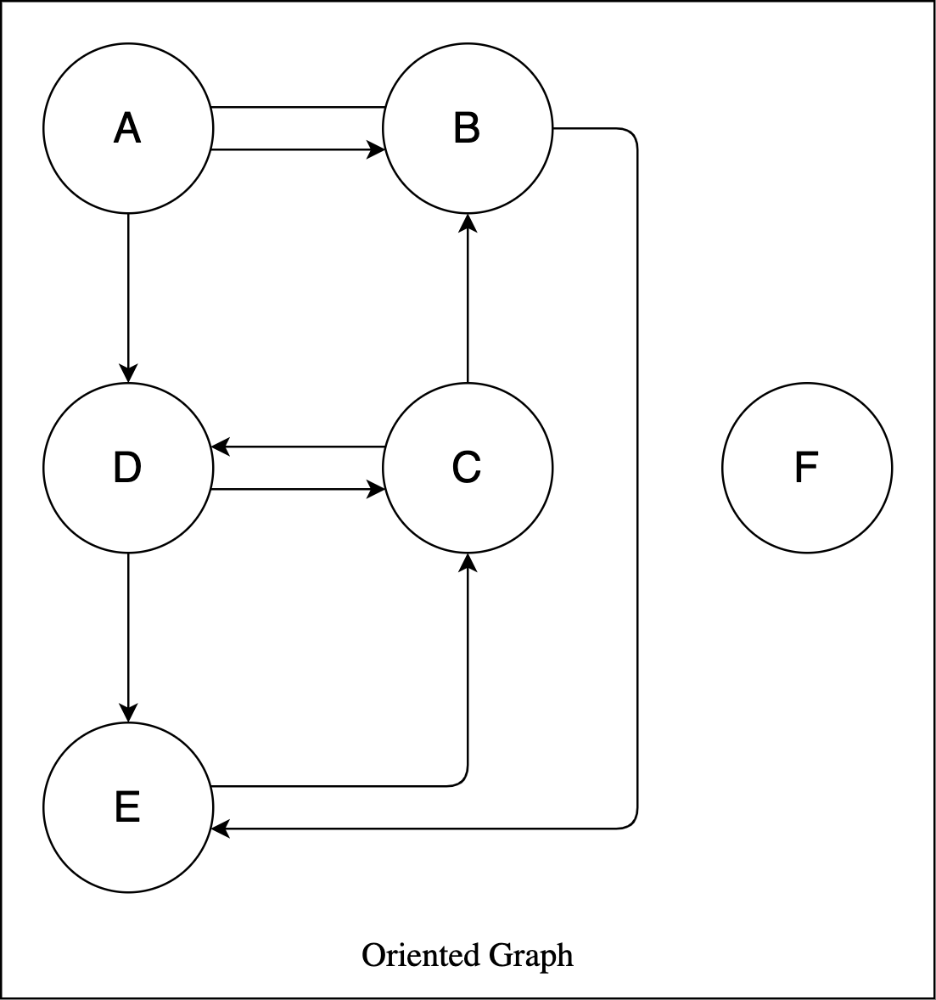

# Implementazione di grafi in Python

Le strutture dati sono i costrutti fondamentali attorno ai quali si costruiscono i programmi. Ogni struttura di dati organizza i dati in maniera diversa e fornisce metodi di gestione differenti. Ciascuna struttura dati, a seconda del caso d'uso, può fornire prestazioni, gradi di complessità e utilizzi di memoria migliori o peggiori.

Il grafo è un tipo di struttura dati astratta che ha lo scopo di implementare schemi logici basati su nodi e archi. Un grafo può essere orientato, se gli archi specificano una direzione (frecce) oppure non orientati se gli archi non indicano direzionalità. Gli archi possono essere con peso o senza peso, dove il peso è un'informazione caratteristica di un arco, ad esempio la lunghezza di un arco che collega due nodi.

Il linguaggio Python non dispone di una libreria standard per la rappresentazione di grafi. In questa repository vengono descritte alcune strategie di rappresentazione di grafi in Python, implementate manualmente sfruttando strutture dati standard oppure sfruttando librerie esterne.

## Dizionari

Un modo semplice per implementare una rappresentazione sia di grafi orientati sia non orientati in Python è quello di utilizzare i *dizionari* ([dict](https://docs.python.org/3/library/stdtypes.html#dict)).

Per la rappresentazione dei grafi, verranno utilizzati due grafi:

1. Grafo non orientato
2. Grafo orientato

Quindi si avranno due implementazioni differenti, entrambe basate sul pattern della programmazione ad oggetti.

## 1 — Grafo non orientato



La rappresentazione di questo grafo, con un dizionario Python, è composta indicando un nodo nodo come *chiave* e gli archi a lui associato come *array di valori*:

```python
# rappresentazione completa del grafo non orientato
graph = {
  "A": ["B", "D"],
  "B": ["A", "C", "E"],
  "C": ["B", "D", "E"],
  "D": ["A", "C", "E"],
  "E": ["B", "C", "D"],
  "F": []
}
```

tale rappresentazione è completa ma anche ridondante, perché contiene informazioni che possono essere superflue, ad esempio si `graph['A'][0]` e `graph['B'][0]` dal punto di vista implementativo sono diversi, ma dal punto di vista logico (secondo il grafo non orientato) sono la stessa cosa.

Una versione normalizzata, senza ridondanza ma logicamente equivalente, potrebbe essere:

```python
# rappresentazione normalizzata del grafo non orientato
graph = {
  "A": ["B", "D"],
  "B": ["C", "E"],
  "C": ["D", "E"],
  "E": ["D"],
  "F": []
}
```


## 2 — Grafo orientato



<p style="text-align: center">Immagine 2</p>